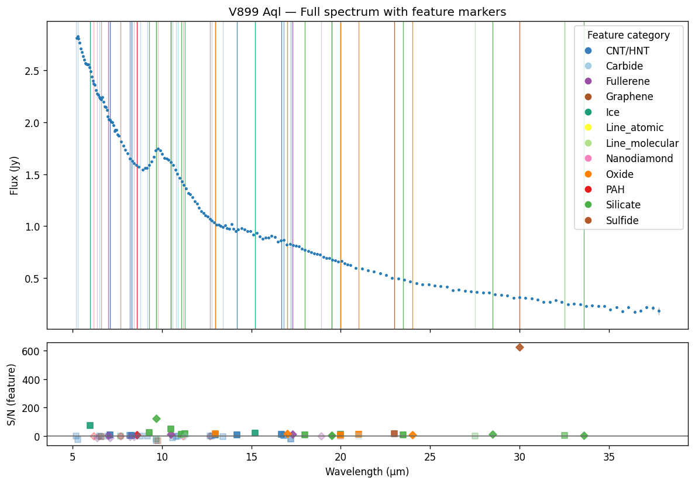
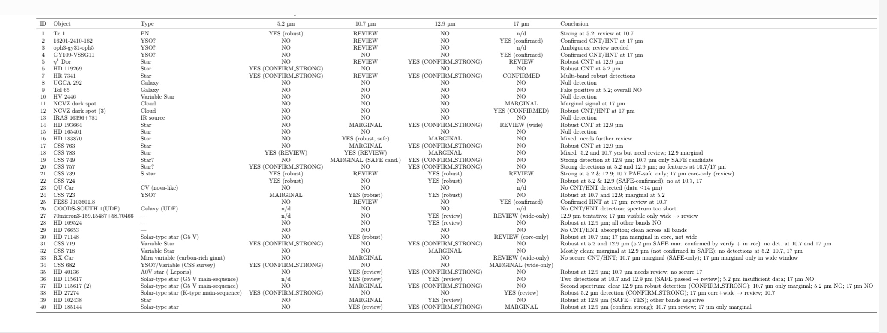
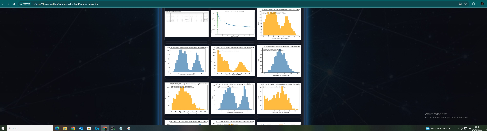
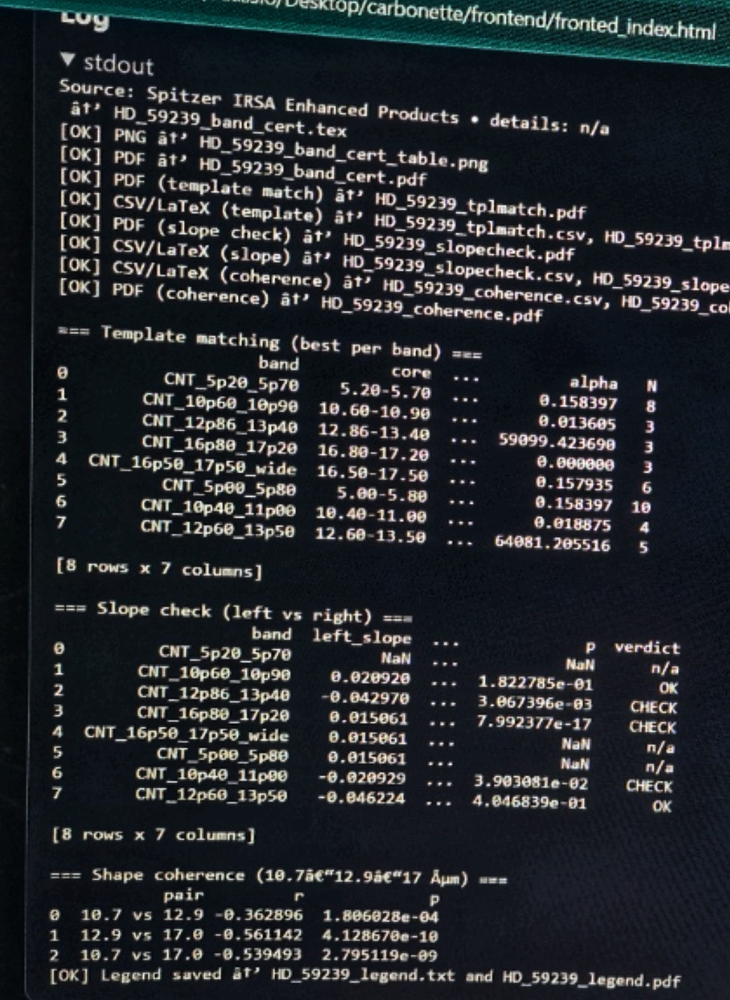
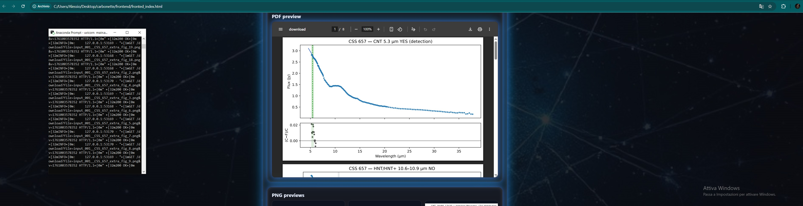

[](https://www.python.org/)


[](https://colab.research.google.com/drive/1dJa6AWhzvwLr1PrgWsk-M0FvqMOJ0k52/copy)

<p align="center">
  
</p>

# Carbonette — automated mid-IR spectroscopy for CNT/HNT candidates, known-feature rejection, and full anomaly reporting across Spitzer/IRS spectra.

# CARBONETTE CNT/HNT pipeline v1.0.0
<p>Author: M. Vengher 2025</p>

<p>Purpose: Automated spectral analysis for CNT/HNT feature detection (5–34 µm)</p>
<p>Methods: quick-look, SAFE masks, LSF injection-recovery, core–wide coherence,
template matching (Chen & Li 2019/2020-2022), slope & shape coherence tests.</p>

### Carbonette scans infrared spectra and highlights where carbon nanotube (CNT) and hydrogenated nanotube (HNT) bands might be hiding. It’s a careful filter: it doesn’t declare discoveries, it shows where the data deserve a closer look. This analysis engine is based on publicly available Spitzer spectra (IRSA Enhanced Products) and tests the infrared bands predicted for carbon nanotubes by Chen & Li (2019/2022). The authors of those studies are not affiliated with or responsible for this project.
(JWST analyzer extension - work in progress)
# <p>A reproducible end-to-end CNT/HNT spectral analysis tool.</p>
 

<p align="center">
  
</p>

## <p> 40 SPITZER Irsa Enhanced products _ Objects analyzed with CARBONETTE _ quik_look </p>
<p align="center">
  
</p>

# 🌌 CARBONETTE
Automated CNT/HNT Spectral Detection Pipeline  
[](
https://colab.research.google.com/drive/1dJa6AWhzvwLr1PrgWsk-M0FvqMOJ0k52/copy)


## 🎯 Overview
CARBONETTE is an automated pipeline for detecting Carbon NanoTube (CNT) and Hydrogenated NanoTube (HNT) absorption features in infrared astronomical spectra. The system processes data directly from NASA's IRSA Enhanced Products Catalog and implements a rigorous multi-validation framework to >ensure scientifically robust detections.

<p align="center">
  
</p>

## ✨ Comprehensive Validation Framework

### 📊 **Primary Detection Metrics**
- **Signal-to-Noise Ratio (S/N)** calculation with proper error propagation
- **Δχ² Significance Testing** for feature detection confidence
- **Equivalent Width (EW)** and **Mean Optical Depth (τ)** measurements
- **Multi-threshold Classification**: 
  - YES (detection): S/N ≥ 3.0σ AND √Δχ² ≥ 3.0σ
  - MARGINAL: 2.0σ ≤ S/N < 3.0σ
  - NO: S/N < 2.0σ

### 🛡️ **Contamination Avoidance (SAFE System)**
- **Literature-informed anchor regions** for continuum fitting
- **PAH contamination checks** at 11.2-11.3μm and 12.7μm
- **Water vapor avoidance** at 5.3μm regions
- **Standard vs SAFE band comparison** with automatic promotion rules
- ** Masks and anchors from literature

### 📏 **Instrumental Validation**
- **Line Spread Function (LSF) resolution checks**
- **Width-to-LSF ratio analysis** ensuring features are instrumentally resolved
- **Rebinning consistency** across different spectral resolutions (R=1, R=2)

### 🧪 **Completeness & Reliability Testing**
- **Injection-Recovery analysis** with 200 bootstrap iterations
- **Multiple depth testing** (0.5%, 1.0%, 2.0% absorption depths)
- **Recovery rate calibration** and probability estimation
- **Detection completeness mapping** across parameter space

### 🔄 **Stability & Robustness Verification**
- **Core-edge sensitivity analysis** (±0.05μm shifts)
- **Jackknife resampling** for uncertainty estimation
- **Continuum model comparison** (linear vs quadratic fitting)
- **Rebinning consistency checks** across resolutions

<p align="center">
  
</p>


### 🎯 **Physical Validation**
- **Template matching** against established CNT/HNT models (Chen & Li 2019)
- **Best-fit identification** with Δχ² minimization
- **Slope asymmetry analysis** for feature shape coherence
- **Cross-band correlation** testing


<p align="center">
  
</p>


### 📈 **Advanced Statistical Framework**
- **Benjamini-Hochberg FDR correction** for multiple hypothesis testing
- **False Discovery Rate control** at α=0.05
- **Dynamic p-value thresholding** based on number of tests
- **Matched filtering confirmation** as independent validation

### 🚫 **Quality Control Flags**
- **PAH leakage detection** at 11.2μm
- **Anchor point sufficiency** checks (minimum 2 required)
- **Core data point validation** (minimum 3 required)
- **Global spectral masking** of known emission lines

## 📋 **Output Generation**

### 📄 **Professional Reporting**
- **Publication-ready PDF reports** with full analysis summaries
- **LaTeX source files** for custom formatting
- **CSV data exports** for further analysis
- **Multi-format plots** with residual panels

### 🔍 **Comprehensive Validation Summaries**
- **Band-by-band certification tables**
- **Standard vs SAFE comparison reports**
- **Core vs Wide confirmation analysis**
- **Injection-recovery completeness maps**

## 🚀 **Technical Features**

### 🌐 **Data Integration**
- **Direct IRSA Enhanced Products Catalog access**
- **Automated spectral data retrieval**
- **Flexible input formats** (wavelength, flux, error, flag)
- **Intelligent data parsing** with error handling

### ⚙️ **Configurable Analysis**
- **User-defined detection thresholds**
- **Customizable band definitions**
- **Adjustable rebinning factors**
- **Flexible anchor region specification

### 🔧 **Robust Implementation**
- **Error propagation** throughout all calculations
- **Outlier-resistant** continuum fitting
- **Graceful degradation** with insufficient data
- **Comprehensive logging** and progress tracking

## 🎪 **Final Detection Certification**

A **"YES (robust)"** detection requires:
```
✅ Primary S/N ≥ 3.0σ AND √Δχ² ≥ 3.0σ
✅ SAFE variant confirmation (where applicable)  
✅ LSF resolution adequacy (width/LSF > 5)
✅ Injection-recovery rate ≥ 80% at relevant depth
✅ Stability tests passed (rebin, edge, jackknife, poly2)
✅ Template matching consistency
✅ FDR-corrected significance
```
<p align="center">
  
</p>

## 📚 **Scientific Foundation**

The pipeline implements methodologies from established astronomical spectroscopy literature, with particular attention to:
- Continuum placement in uncontaminated spectral regions
- Statistical significance validation
- Instrumental effect quantification
- Contamination avoidance strategies

---


**CARBONETTE represents a comprehensive, validation-focused approach to spectral feature detection, implementing professional-grade astronomical analysis techniques in an automated, reproducible framework.**

Tests made to build this pipeline: All objects analyzed with this pipeline are
drawn from the IRSA Spitzer Enhanced Products archive.

# 📁 **Directory structure**
The repository includes:
- `engine/` — the analytical core (CNT/HNT detection algorithms)
- `run/` — runtime data and input tables
- `fronted/` — user-facing interface (HTML pages and visual components)

(Note: the typo “fronted” is intentionally kept for internal compatibility with existing code paths.)


# 🚀 How to Run the Project

### Tested with Python 3.11 (Conda-forge environment). Developed and tested on Windows 10 (compatible with macOS/Linux environments).

## COMPATIBLE WITH LINUX AND MACOS


## PLEASE OPEN CARBONETTE_TREE.TXT AND FOLLOW THAT ORDER.
## CREATE FOLDERS WITH THE EXACT NAMES. 

Place shim.py and irsa_fetch.py in ./engine/
Place CNT_engine.py inside ./engine/raw/
Create ./run/ folders before running main.py
Archive will create automatically

# 1. Clone the repository  
   `git clone https://github.com/Mihart-web/CARBONETTE.git`

# 2. Create and activate a virtual environment  
   `conda create -n carbonette python=3.11`  
   `conda activate carbonette`

# 3. Install dependencies  
   `pip install -r requirements.txt`

# 4. Run the API server  
   `uvicorn main:app --reload --port 8001`

# 5. Open the documentation  
   Go to `http://127.0.0.1:8001/docs` in your browser

### ( if the Spitzer Enhanced Products catalog button doesn't work, substitute the link in the fronted html by opening it in txt.) replace with this link: [https://irsa.ipac.caltech.edu/cgi-bin/Gator/nph-dd](https://irsa.ipac.caltech.edu/cgi-bin/Gator/nph-scan?submit=Select&projshort=Spitzer)

### In fronted html, open in txt subsitute the link:
<a> Analyze section---</a>
### 👇
class="glowbtn" href="https://irsa.ipac.caltech.edu/workspace/TMP_wE95AY_32284/Gator/irsa/14923/tbview.html" target="_blank" rel="noopener"
  Spitzer IRSA Enhanced Products Catalog


### IRS Enhanced Products - Select- put the blue dot on "All sky search" Run Query - you will get full catalog with all objects names and RA/DEC. 


Control tha API and if is online, open the interface by clikking on the fronted_index. html to open the site. 

Anaconda Prompt (Miniconda3) in my case

    conda activate carbonette         <------- put this command in your Python prompt
                                         after you installed all requirements
                                         pip install -r requirements.txt installs all programs in there
                                         my project is called "carbonette" — you can call it "happypie"
                                         in that case, the command in your prompt will be:
                                         conda activate happypie
                                
    cd %USERPROFILE%\Desktop\carbonette <------- change the name of the project folder
                                               with the name you gave it
                                               and the location on your computer where you have it.
                                               in this case, I have the project folder with the engine etc.
                                               on my Desktop, and the folder is called "carbonette"
    cd ~/carbonette For Linux/macOS
    
uvicorn main:app --reload --port 8001  <------- this is the command you put in your Python prompt to start the FastAPI

### Please note that if main.py is inside engine folder,                                                
This input will become : uvicorn engine.main:app --reload --port 8001
I suggest to keep main.py in the carbonette main folder. 

         http://127.0.0.1:8001/docs    <------- this is the site’s main page (paste it in the browser tab)

           http://127.0.0.1:8001       <-------- If you are online, this should say:
                                                     “Carbonette API is alive!”
                                                     

### 🔹 Notes
- `main.py` imports `engine.shim`, so `shim.py` **must stay** inside `engine/`.
- The actual analysis engine lives in `engine/raw/` (usually one `.py` file that produces outputs).
- The system expects to read and write everything relative to this structure.  
  Changing folder names will break imports and file paths.
- The `run/` and `archive/` folders are automatically created when the pipeline is executed.
- The frontend HTML (`fronted_index.html`) must stay inside the `frontend/` directory.

### 🔹 Optional
If you are adding a new module:
- place helper scripts inside `engine/` (e.g., `engine/irsa_fetch.py`);
- do **not** put them directly under `engine/raw/` — that folder is reserved for the executable analysis core.


# Google Colab_Ready

 ├── Google Colab/ENGINE - Copy-Paste ready to use
 
 └── Google Colab/CARBONETTE for Google Colab.pdf

## 🧪 Run in Google Colab

Want to try Carbonette in your browser?  

Copy-paste full Google Colab ready code in your new notebook. 

https://github.com/Mihart-web/CARBONETTE/blob/main/Google%20Colab/ENGINE%20-%20Copy-Paste%20ready%20to%20use

No installation required.

Hit Run. Or watch pdf to insert your IRSA data. 


## 🤝 Contributing to Carbonette

Contributions are very welcome!

If you'd like to improve **Carbonette** — by adding new spectral modules, extending JWST/MIRI support, refining the interface, or improving documentation — you can help by following these steps:

1. **Fork** this repository and create a new branch for your edits.  
2. **Implement** your changes (please keep the code clear and well-commented).  
3. **Submit a Pull Request (PR)** with a short description of what you’ve added or fixed.  
4. For larger contributions (for example, adding new band templates, validation methods, or backend features), please open an **Issue** first to discuss the idea before coding.  

All accepted contributors will be credited in the changelog and future releases.  
The project is distributed under the [MIT License](LICENSE), which allows reuse and derivative work — please cite **Carbonette (ASCL:YYYY.NNN)** in any scientific work that uses this code or its results.

Thank you for helping expand the Carbonette pipeline and making CNT/HNT detection more accessible to the community!


## Citation
If you use Carbonette in your research, please cite:
Vengher, M. (2025). Carbonette: Automated CNT/HNT Spectral Detection Pipeline. 

